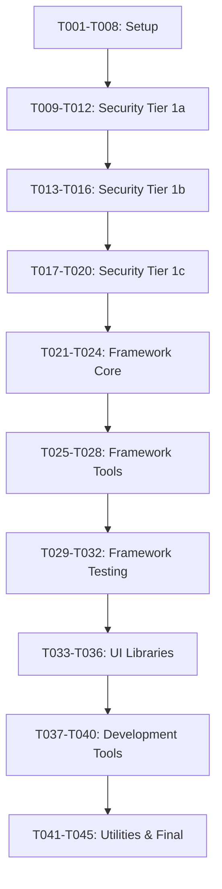

# Package Upgrade Matrix

Generated: 2025-01-27 17:40:00
**Total Packages**: 49 packages requiring upgrades

---

## Legend
- 🔴 **Critical** - High risk, breaking changes, security issues
- 🟡 **Medium** - Moderate risk, some breaking changes  
- 🟢 **Low** - Low risk, backward compatible
- ⚡ **Priority** - Security vulnerability requiring immediate attention
- 🔗 **Dependency** - Has significant dependencies on other packages

---

## Tier 1: Critical Security Upgrades (T009-T020)

| Package | Current | Target | Risk | Priority | Complexity | Notes |
|---------|---------|--------|------|----------|------------|--------|
| axios | 0.21.1 | 1.12.2 | 🔴 | ⚡ | HIGH | RCE vulnerabilities, API changes |
| mongodb | 3.6.9 | 6.20.0 | 🔴 | ⚡ | HIGH | Auth exposure, connection API rewrite |
| next-auth | 3.26.1 | 4.24.11 | 🔴 | ⚡ | HIGH | JWT vulnerabilities, config changes |
| typeorm | 0.2.34 | 0.3.27 | 🔴 | ⚡ | HIGH | SQL injection, complete API rewrite |

**Estimated Time**: 8-12 hours
**Testing Required**: Full integration testing after each upgrade
**Rollback Complexity**: HIGH - Each upgrade requires checkpoint

---

## Tier 2: Framework Compatibility (T021-T032)

### Core Framework
| Package | Current | Target | Risk | Priority | Complexity | Notes |
|---------|---------|--------|------|----------|------------|--------|
| next | 14.2.33 | 15.5.4 | 🔴 | 🔗 | HIGH | App Router changes, affects many packages |
| react | 18.3.1 | 19.1.1 | 🔴 | 🔗 | HIGH | Concurrent features, affects all React packages |
| react-dom | 18.3.1 | 19.1.1 | 🔴 | 🔗 | HIGH | Must upgrade with React |
| @types/react | 18.3.24 | 19.1.14 | 🟡 | 🔗 | MEDIUM | Type definitions for React 19 |
| @types/react-dom | 18.3.7 | 19.1.9 | 🟡 | 🔗 | MEDIUM | Type definitions for React DOM |

### Build Tools & TypeScript
| Package | Current | Target | Risk | Priority | Complexity | Notes |
|---------|---------|--------|------|----------|------------|--------|
| @types/node | 15.12.2 | 24.5.2 | 🟡 |  | MEDIUM | Node.js type definitions |
| typescript | 5.9.2 | 5.9.2 | 🟢 |  | LOW | Already at target version |
| postcss | 8.5.6 | 8.5.6 | 🟢 |  | LOW | Already at target version |
| cross-env | 7.0.3 | 10.0.0 | 🟡 |  | MEDIUM | Environment variable handling |

**Estimated Time**: 6-8 hours
**Testing Required**: Full application testing, E2E tests
**Rollback Complexity**: HIGH - Framework changes affect entire app

---

## Tier 3: UI & Development Dependencies (T033-T040)

### Styling & UI Framework
| Package | Current | Target | Risk | Priority | Complexity | Notes |
|---------|---------|--------|------|----------|------------|--------|
| tailwindcss | 3.4.17 | 4.1.13 | 🔴 |  | HIGH | Major version change, config breaking |
| autoprefixer | 10.4.21 | 10.4.21 | 🟢 |  | LOW | Already at target version |
| bootstrap | 4.6.0 | 5.3.8 | 🔴 |  | HIGH | Major Bootstrap version change |
| react-bootstrap | 1.6.1 | 2.10.10 | 🔴 | 🔗 | HIGH | Must upgrade after React & Bootstrap |
| styled-components | 5.3.0 | 6.1.19 | 🟡 |  | MEDIUM | React 18+ compatibility improvements |

### Radix UI Components
| Package | Current | Target | Risk | Priority | Complexity | Notes |
|---------|---------|--------|------|----------|------------|--------|
| @radix-ui/react-accordion | 1.2.12 | 1.2.12 | 🟢 |  | LOW | Already at target version |
| @radix-ui/react-alert-dialog | 1.1.15 | 1.1.15 | 🟢 |  | LOW | Already at target version |
| @radix-ui/react-checkbox | 1.3.3 | 1.3.3 | 🟢 |  | LOW | Already at target version |
| @radix-ui/react-dialog | 1.1.15 | 1.1.15 | 🟢 |  | LOW | Already at target version |
| @radix-ui/react-radio-group | 1.3.8 | 1.3.8 | 🟢 |  | LOW | Already at target version |
| @radix-ui/react-select | 2.2.6 | 2.2.6 | 🟢 |  | LOW | Already at target version |
| @radix-ui/react-switch | 1.2.6 | 1.2.6 | 🟢 |  | LOW | Already at target version |
| @radix-ui/react-tabs | 1.1.13 | 1.1.13 | 🟢 |  | LOW | Already at target version |

### Rich Text Editor
| Package | Current | Target | Risk | Priority | Complexity | Notes |
|---------|---------|--------|------|----------|------------|--------|
| @ckeditor/ckeditor5-build-classic | 28.0.0 | 44.3.0 | 🔴 |  | HIGH | Major editor version change |
| @ckeditor/ckeditor5-editor-classic | 28.0.0 | 46.1.1 | 🔴 |  | HIGH | Major editor version change |
| @ckeditor/ckeditor5-image | 28.0.0 | 46.1.1 | 🔴 |  | HIGH | Major editor version change |
| @ckeditor/ckeditor5-react | 3.0.2 | 11.0.0 | 🔴 |  | HIGH | Major React integration changes |

**Estimated Time**: 4-6 hours
**Testing Required**: UI testing, visual regression tests
**Rollback Complexity**: MEDIUM - Mostly UI changes

---

## Tier 4: Utility & Helper Libraries (T041-T045)

### Utility Libraries
| Package | Current | Target | Risk | Priority | Complexity | Notes |
|---------|---------|--------|------|----------|------------|--------|
| slugify | 1.5.3 | 1.6.6 | 🟢 |  | LOW | Minor version bump |
| @popperjs/core | 2.9.2 | 2.11.8 | 🟢 |  | LOW | Bug fixes and improvements |
| jquery | 3.6.0 | 3.7.1 | 🟢 |  | LOW | Security and bug fixes |
| isomorphic-unfetch | 3.1.0 | 4.0.2 | 🟡 |  | MEDIUM | May have breaking changes |

### React Utility Libraries
| Package | Current | Target | Risk | Priority | Complexity | Notes |
|---------|---------|--------|------|----------|------------|--------|
| react-device-detect | 1.17.0 | 2.2.3 | 🟡 |  | MEDIUM | API changes possible |
| react-image-file-resizer | 0.4.4 | 0.4.8 | 🟢 |  | LOW | Minor version bump |
| react-share | 4.4.0 | 5.2.2 | 🟡 |  | MEDIUM | Major version change |
| react-slick | 0.28.1 | 0.31.0 | 🟡 |  | MEDIUM | Minor API improvements |
| react-social-icons | 5.4.1 | 6.25.0 | 🟡 |  | MEDIUM | Major version change |

### Theming & Styling
| Package | Current | Target | Risk | Priority | Complexity | Notes |
|---------|---------|--------|------|----------|------------|--------|
| next-themes | 0.2.1 | 0.4.6 | 🟡 |  | MEDIUM | Theme system improvements |
| tailwind-merge | 2.6.0 | 3.3.1 | 🟡 |  | MEDIUM | Major version change |

### Data & API Libraries
| Package | Current | Target | Risk | Priority | Complexity | Notes |
|---------|---------|--------|------|----------|------------|--------|
| swr | 0.5.6 | 2.3.6 | 🔴 |  | HIGH | Major version changes |
| next-sitemap | 1.6.108 | 4.2.3 | 🔴 |  | HIGH | Major version changes |

**Estimated Time**: 2-4 hours
**Testing Required**: Feature testing, integration tests
**Rollback Complexity**: LOW - Minimal impact on core functionality

---

## Development & Testing Dependencies

### Testing Framework
| Package | Current | Target | Risk | Priority | Complexity | Notes |
|---------|---------|--------|------|----------|------------|--------|
| jest | 27.0.4 | 30.1.3 | 🔴 | 🔗 | HIGH | Major version change, config changes |
| babel-jest | 27.0.2 | 30.1.2 | 🔴 | 🔗 | HIGH | Must upgrade with Jest |
| @testing-library/user-event | 13.1.9 | 14.6.1 | 🟡 | 🔗 | MEDIUM | Requires @testing-library/dom |

### Development Tools
| Package | Current | Target | Risk | Priority | Complexity | Notes |
|---------|---------|--------|------|----------|------------|--------|
| prettier | 2.3.1 | 3.6.2 | 🟡 |  | MEDIUM | Major version change |
| @vitejs/plugin-react | 5.0.3 | 5.0.4 | 🟢 |  | LOW | Minor version bump |
| react-scripts | 4.0.3 | 5.0.1 | 🔴 |  | HIGH | Major version change |

---

## Package Removal Candidates

### Potentially Unused (from depcheck analysis)
- @ckeditor/ckeditor5-editor-classic (redundant with build-classic)
- @ckeditor/ckeditor5-image (redundant with build-classic)
- @popperjs/core (may be unused)
- autoprefixer (may be handled by PostCSS)
- mongodb (if not using direct MongoDB connection)
- next-offline (legacy PWA solution)
- npm (should not be in dependencies)
- postcss (may be handled automatically)
- react-scripts (if migrated to Next.js fully)
- styled-components (if using Tailwind exclusively)
- typeorm (if not using database ORM)

---

## Upgrade Schedule & Dependencies

### Phase Ordering

### Dependency Relationships
- **mongodb** must be upgraded before **typeorm**
- **React** must be upgraded before **@radix-ui**, **react-bootstrap**
- **Next.js** should be upgraded after **React** but before **next-auth** final testing
- **Jest** should be upgraded after **React** and **@testing-library** packages
- **Tailwind CSS** can be upgraded independently
- **CKEditor** packages should be upgraded together

---

## Risk Mitigation Strategy

### High-Risk Package Handling
1. **Create checkpoint before each high-risk upgrade**
2. **Test thoroughly after each upgrade**
3. **Have rollback procedure ready**
4. **Update documentation immediately**

### Medium-Risk Package Handling
1. **Group related packages together** 
2. **Test after group completion**
3. **Document any issues found**

### Low-Risk Package Handling
1. **Can be upgraded in batches**
2. **Test after batch completion**
3. **Minimal rollback concerns**

---

## Success Metrics

### Per-Package Success Criteria
- ✅ Package installs without errors
- ✅ Application builds successfully  
- ✅ No new TypeScript errors
- ✅ All tests continue to pass
- ✅ No new security vulnerabilities introduced
- ✅ Performance maintained or improved

### Phase Success Criteria
- ✅ All packages in phase upgraded successfully
- ✅ Integration testing passes
- ✅ E2E testing passes  
- ✅ No regression in core functionality
- ✅ Security audit shows improvement

---

## Estimated Timeline

**Total Estimated Time**: 20-30 hours
- **Setup Phase (T001-T008)**: 4 hours ✅
- **Security Phase (T009-T020)**: 8-12 hours
- **Framework Phase (T021-T032)**: 6-8 hours  
- **UI Phase (T033-T040)**: 4-6 hours
- **Utilities Phase (T041-T045)**: 2-4 hours

**Recommended Schedule**: 
- **Week 1**: Setup + Security Phase
- **Week 2**: Framework Phase  
- **Week 3**: UI + Utilities Phase + Final Testing